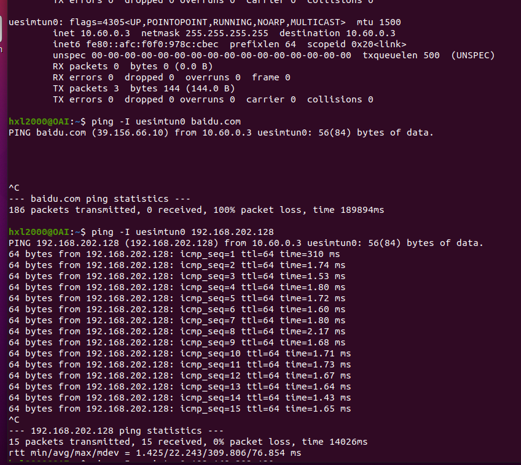
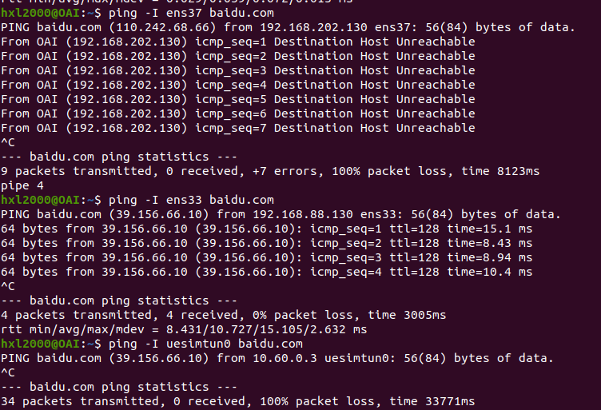
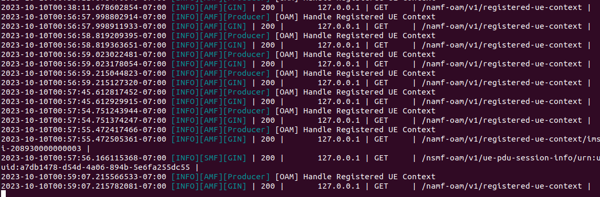

网络拓扑：
[free5gc核心网] --网线-- [OAI gNB/eNB ---- 127.0.0.1::4043 ---- OAI UE]
一台Ubuntu运行free5gc充当核心网，另一台Ubuntu主机运行OAI gNB和模拟UE。在Ubuntu 20.04.6LTS版本可行。

<!-- more -->

## Free5gc

### Free5gc安装

Free5gc的参考文档:[Home · free5gc/free5gc Wiki (github.com)](https://github.com/free5gc/free5gc/wiki)

#### 前置条件

##### Go 安装

Free5gc使用Go 1.17.8构建，因此需要先安装该版本的Golang：

```bash
wget https://dl.google.com/go/go1.17.8.linux-amd64.tar.gz
sudo tar -C /usr/local -zxvf go1.17.8.linux-amd64.tar.gz
mkdir -p ~/go/{bin,pkg,src}
# The following assume that your shell is bash
echo 'export GOPATH=$HOME/go' >> ~/.bashrc
echo 'export GOROOT=/usr/local/go' >> ~/.bashrc
echo 'export PATH=$PATH:$GOPATH/bin:$GOROOT/bin' >> ~/.bashrc
echo 'export GO111MODULE=auto' >> ~/.bashrc
source ~/.bashrc
```

##### 用户面依赖

```bash
sudo apt -y update
sudo apt -y install mongodb wget git
sudo systemctl start mongodb
```

##### 控制面依赖

```bash
sudo apt -y update
sudo apt -y install git gcc g++ cmake autoconf libtool pkg-config libmnl-dev libyaml-dev
```

#### 源码下载与编译

##### 源码下载

```bash
cd ~
git clone --recursive -b v3.2.1 -j `nproc` https://github.com/free5gc/free5gc.git
cd free5gc
```

##### 编译源码

```bash
cd ~/free5gc
make
```

注意如果出现了编译失败，有可能是在上一步的源码下载部分出现问题。使用如下命令删除后重新下载：

```bash
cd ~
sudo rm -rf free5gc
```

#### UPF功能安装

```bash
cd ~
git clone -b v0.6.8 https://github.com/free5gc/gtp5g.git
cd gtp5g
make
sudo make install
```

#### WebConsole安装

Webconsole可用于观察UE注册信息。

##### 安装依赖

```bash
sudo apt install curl
sudo apt remove cmdtest
sudo apt remove yarn
curl -sS https://dl.yarnpkg.com/debian/pubkey.gpg | sudo apt-key add -
echo "deb https://dl.yarnpkg.com/debian/ stable main" | sudo tee /etc/apt/sources.list.d/yarn.list
curl -sL https://deb.nodesource.com/setup_12.x | sudo -E bash -
sudo apt-get update
sudo apt-get install -y nodejs yarn
```

##### 下载编译源码

```bash
cd ~/free5gc
make webconsole
```


### 运行WebConsle
```bash

cd ~/free5gc/webconsole
./bin/webconsole
```
### 运行Free5gc核心网
新建一个终端，输入如下指令：
```bash
cd ~/free5gc
./run.sh
```
### 退出Free5gc核心网
如果在启动Free5gc核心网时遇到问题，在按下`ctrl+c`后还需关闭掉其他的一些已启动的进程：
```bash
cd ~/free5gc
./force_kill.sh
```

### Free5gc配置

配置`/config`下面的`amfcfg.yaml`,`smfcfg.yaml`以及`upfcfg.yaml`。

修改`amfcfg.yaml`中`plmnd`字段下所有的`mnc`和`mcc`，同时修改`ngapIpList`中的IP地址为运行核心网的主机上网用的IP地址。如：

#### amfcfg.yaml

```yaml
ngapIpList:  # the IP list of N2 interfaces on this AMF
    - 10.25.18.205
...
servedGuamiList: # Guami (Globally Unique AMF ID) list supported by this AMF
    # <GUAMI> = <MCC><MNC><AMF ID>
    - plmnId: # Public Land Mobile Network ID, <PLMN ID> = <MCC><MNC>
        mcc: 466 # Mobile Country Code (3 digits string, digit: 0~9)
        mnc: 92 # Mobile Network Code (2 or 3 digits string, digit: 0~9)
      amfId: cafe00 # AMF identifier (3 bytes hex string, range: 000000~FFFFFF)
  supportTaiList:  # the TAI (Tracking Area Identifier) list supported by this AMF
    - plmnId: # Public Land Mobile Network ID, <PLMN ID> = <MCC><MNC>
        mcc: 466 # Mobile Country Code (3 digits string, digit: 0~9)
        mnc: 92 # Mobile Network Code (2 or 3 digits string, digit: 0~9)
      tac: 1 # Tracking Area Code (uinteger, range: 0~16777215)
  plmnSupportList: # the PLMNs (Public land mobile network) list supported by this AMF
    - plmnId: # Public Land Mobile Network ID, <PLMN ID> = <MCC><MNC>
        mcc: 466 # Mobile Country Code (3 digits string, digit: 0~9)
        mnc: 92 # Mobile Network Code (2 or 3 digits string, digit: 0~9)
      snssaiList: # the S-NSSAI (Single Network Slice Selection Assistance Information) list supported by this AMF
        - sst: 1 # Slice/Service Type (uinteger, range: 0~255)
          sd: 010203 # Slice Differentiator (3 bytes hex string, range: 000000~FFFFFF)
        - sst: 1 # Slice/Service Type (uinteger, range: 0~255)
          sd: 112233 # Slice Differentiator (3 bytes hex string, range: 000000~FFFFFF)
```

#### smfcfg.yaml

修改N3接口的IP地址：

```yaml
interfaces: # Interface list for this UPF
          - interfaceType: N3 # the type of the interface (N3 or N9)
            endpoints: # the IP address of this N3/N9 interface on this UPF
              - 10.25.18.205
```

#### upfcfg.yaml

修改gtpude的N3接口的IP地址：

```yaml
gtpu:
  forwarder: gtp5g
  # The IP list of the N3/N9 interfaces on this UPF
  # If there are multiple connection, set addr to 0.0.0.0 or list all the addresses
  ifList:
    - addr: 10.25.18.205
      type: N3
      # name: upf.5gc.nctu.me
      # ifname: gtpif
```


## OAI基站与射频仿真的安装与使用

### 下载编译源码

```bash
cd ~
git clone https://gitlab.eurecom.fr/oai/openairinterface5g.git
cd ~/openairinterface5g/cmake_targets
./build_oai -I --gNB --nrUE -w SIMU --ninja
```
- -I: 安装所有的必需库，一般来说只需要安装一次。
- -w: 用于选择射频设备前端。可选USRP或者SIMU，后者是单独构建RFSimulator，前者是除了USRP外也同时构建RFSimulator，所以一般我们选择USRP。
- --gNB: 用于构建nr-softmodem和nr-cuup的可执行文件以及其所需的库。
- --nrUE: 用于构建nr-uesoftmodem的可执行文件以及其所需的库。
- --ninja: 使用ninja构建工具，可以加速编译过程。
- -c: 清空工作区，并强制进行一个完全的构建。

### RF Simulator  

RF Simulator测试是指，在没有真实的RF板的情况下，使用RF Simulator替代真实的RF板子，进进行OAI功能性测试。当然，性能可能要比有真实的RF板时差很多。

在RF Simulator的情况下，数据的来源有两种模式：

- "noS1" mode：在这种模式下，通过UE侧和核心网侧的ping和iperf工具，把基站和UE之间的传输通道，在两侧进行数据传输数据。

- "phy-test" mode：在这种模式下，在每个MAC层调度周期内，基站随机的发送一些DL下行数据，而手机随机地发送一些UL上行数据。


系统架构说明：

- 如果Linx-1（UE）和Linux-2（基站）是同一个服务器，则IP数据包不会通过oaitun_enb1和oaitun_ue1这两个物理接口的驱动，直接被IP层间直接路由，从而导致数据包不会经过空口协议栈。

- 网络接口oaitun_ue1，是UE可执行程序nr-uesoftmodem创建的接口驱动，它调用UE的空口协议栈进行数据包的收发。

- 网络接口oaitun_enb1，是基站可执行程序nr-softmodem创建的接口驱动，它调用基站的空口协议栈进行数据包的收发。


### 无核心网仿真测试

配置文件名称说明
- cu/du/gnb/enb：指明设备的部署类型
- sa：5G独立部署
- bandxx：频段
- fr1 or fr2：5G 频谱区间
- tmx：传输模式
- PRB: 分配给SCH信道的PRB个数
- usrpbxxx：OAI支持的实际RF硬件的型号，目前OAI只支持usrpb系列硬件。

#### 运行基站
```bash
cd cmake_targets/ran_build/build
sudo ./nr-softmodem -O ../../../targets/PROJECTS/GENERIC-NR-5GC/CONF/gnb.sa.band66.fr1.106PRB.usrpn300.conf --parallel-config PARALLEL_SINGLE_THREAD --rfsim --phy-test --noS1 --nokrnmod 1
```
- RFSIMULATOR=server：设定基站的RFSIMULATOR为TCP server
- ./nr-softmodem：NR 基站可执行程序
- --parallel-config PARALLEL_SINGLE_THREAD：创建独立的并行线程
- --rfsim：采用RFSIMULATOR，而不是正式的RF硬件
- --phy-test：启动基站的phy test功能，这种功能，每一次调度周期，基站会随机产生一些DL下行数据进行发送。
- -noS1：没有真实的核心网，采用核心网模拟器。
- --nokrnmod 1：没有核心网时设置该flag
- -d：图形显示星座图或其他结果 （Window端需要使用MobaXterm这样的远程终端）
- -O选项指明配置文件的全路径
- 在 gNB 中，--sa 标志执行以下操作：RRC根据配置文件对SIB1进行编码，通过NR-BCCH-DL-SCH传输。
```bash
sudo ./nr-uesoftmodem --rfsim --phy-test --noS1 --nokrnmod 1 --rfsimulator.serveraddr 127.0.0.1
```
基站RFSIMULATOR的IP地址，如果在同一个Linux服务器上，可以使用127.0.0.1。

UE 在 --sa 模式下的命令行参数：
- -C：下行链路载波频率，单位 Hz（默认值 0）
- --CO：上行链路 FDD 频率偏移，单位 Hz（默认值 0）
- --numerology：数字索引（默认值 1）
- -r：以 RB 表示的带宽（默认值 106）
- --band：NR 波段编号（默认值 78）
- --ssb：SSB 起始子载波（默认值 512）
-E: 降低采用频率（3/4的采样率），只有在20M带宽时有效。

在 UE 处，--sa 标志将解码 SIB1 并启动 SA 的 5G NR 初始接入程序：
- 5G-NR RRC 连接设置
- NAS 认证和安全
- 5G-NR AS 安全程序
- 5G-NR RRC 重配置
- 开始下行和上行数据传输
- 基站可以与核心网连接
#### 运行结果
ping包收到相应数据，因为Linx-1（UE）和Linux-2（基站）是同一个服务器，IP数据包不会通过oaitun_enb1和oaitun_ue1这两个物理接口的驱动，直接被IP层间直接路由，从而导致数据包不会经过空口协议栈。



### free5gc核心网+OAI仿真


#### 创建Nets名称空间命令
UE无法直接再同一台机器上直接运行，一种解决方案是在虚拟机中运行UE；另一种更简单的方法是仅为UE创建一个网络名称空间，但在此之前，还需要生成一个虚拟SIM卡：
```bash
##创建一个虚拟网卡对：v-eth2和v-ue2
sudo ip netns delete ueNameSpace2
sudo ip link delete v-eth2
sudo ip netns add ueNameSpace2 
sudo ip link add v-eth2 type veth peer name v-ue2 
ip link list  #查看这一对虚拟网卡

sudo ip link set v-ue2 netns ueNameSpace2 #把v-ue2转移到ueNameSpace空间中去
sudo ip netns exec ueNameSpace2 ip link list

sudo ip addr add 10.201.1.1/24 dev v-eth2 #分配IP地址
sudo ip link set v-eth2 up #启动网卡

sudo iptables -t nat -A POSTROUTING -s 10.201.1.0/255.255.255.0 -o {你上网的网卡名称} -j MASQUERADE  #启动IP伪装，添加了一条规则到NAT表的POSTROUTING链中，对于源IP地址为10.200.1.0网段的数据包，用ens33网口的IP地址替换并发送

sudo iptables -A FORWARD -i {你上网的网卡名称} -o v-eth2 -j ACCEPT 
sudo iptables -A FORWARD -o {你上网的网卡名称} -i v-eth2 -j ACCEPT 
#iptables -A FORWARD这两条语句使能物理网口ens33和v-eth2之间的数据转发

sudo ip netns exec ueNameSpace2 ip link set dev lo up 
sudo ip netns exec ueNameSpace2 ip addr add 10.201.1.2/24 dev v-ue2 
sudo ip netns exec ueNameSpace2 ip link set v-ue2 up 
#给v-ue2设置IP地址，并启动v-ue2

```

注意需要修改`{你上网的网卡名称}`的内容（包括花括号）。使用`ifconfig`命令查看网络连接情况并找到自己上网的网卡。

#### 配置ue和gNB
OAI tag：2023.w20
可参考官方文档[TESTING_5GSA_setup.md](https://gitlab.eurecom.fr/oai/openairinterface5g/-/blob/2023.w20/doc/TESTING_5GSA_setup.md#2-sa-setup-with-oai-nr-ue-softmodem)
gNB的一般配置文件格式参照`targets/PROJECTS/GENERIC-NR-5GC/CONF/*.conf`中的格式修改，修改内容有如下几个关键点：`plmn`中的`mmc`和`mnc`；以及`amf`对应的ip地址和gNB和amf之间的`接口地址`和`网卡名称`。

```yaml	
plmn_list = ({ mcc = 466; mnc = 92; mnc_length = 2; snssaiList = ({ sst = 1 }) });
...
mf_ip_address      = ( { ipv4       = "192.168.202.128"; //核心网的ip地址
                                      ipv6       = "192:168:30::17";
                                      active     = "yes";	//这个不用管
                                      preference = "ipv4";
                                    }
                                  );

         NETWORK_INTERFACES :
            {
                GNB_INTERFACE_NAME_FOR_NG_AMF            = "ens37";				//gNB主机上网的网卡名称
                GNB_IPV4_ADDRESS_FOR_NG_AMF              = "192.168.202.130";	//gNB主机上网的IP地址
                GNB_INTERFACE_NAME_FOR_NGU               = "ens37";				//gNB主机上网的网卡名称
                GNB_IPV4_ADDRESS_FOR_NGU                 = "192.168.202.130";	/gNB主机上网的IP地址
                GNB_PORT_FOR_S1U                         = 2152; # Spec 2152
            };
```

UE的配置比较简单，只要和WebConsole中对应起来即可：

```yaml	
uicc0 = {
imsi = "466920000000003";
key = "8baf473f2f8fd09487cccbd7097c6862";
opc= "8e27b6af0e692e750f32667a3b14605d";
dnn= "internet";
nssai_sst=1;
nssai_sd=0x010203;
}

```

需要注意的是`nssai_sd`使用的是十六进制数。

#### 运行基站

```bash
sudo ./nr-softmodem -O ../../../targets/PROJECTS/GENERIC-NR-5GC/CONF/gnb.sa.band78.fr1.106PRB.usrpb210.conf --gNBs.[0].min_rxtxtime 6 --rfsim --sa
```


#### 运行RFSIM仿真

```bash
sudo ip netns exec ueNameSpace2 bash //进入ueNameSpace2
cd cmake_targets/ran_build/build
sudo ./nr-uesoftmodem -r 106 --numerology 1 --band 78 -C 3619200000 --rfsim --sa -O ../../../targets/PROJECTS/GENERIC-NR-5GC/CONF/ue.conf --rfsimulator.serveraddr 10.201.1.1
```






## SONY & LAB
- SONY：Redmi K40
  * `imsi`：466920000000001
  * `K*`：00112233445566778899aabbccddeeff
  * `OPc`：000102030405060708090a0b0c0d0e0f
- ICFN：OPPO Reno3 PRO 5G
  * `imsi`： 466920000000003
  * `K*`：465B5CE8B199B49FAA5F0A2EE238A6BC
  * `OPc`：E8ED289DEBA952E4283B54E88E6183CA

* Free5gc 默认
  * `imsi`： 208930000000003
  * `K*`：8baf473f2f8fd09487cccbd7097c6862
  * `OPc`：8e27b6af0e692e750f32667a3b14605d