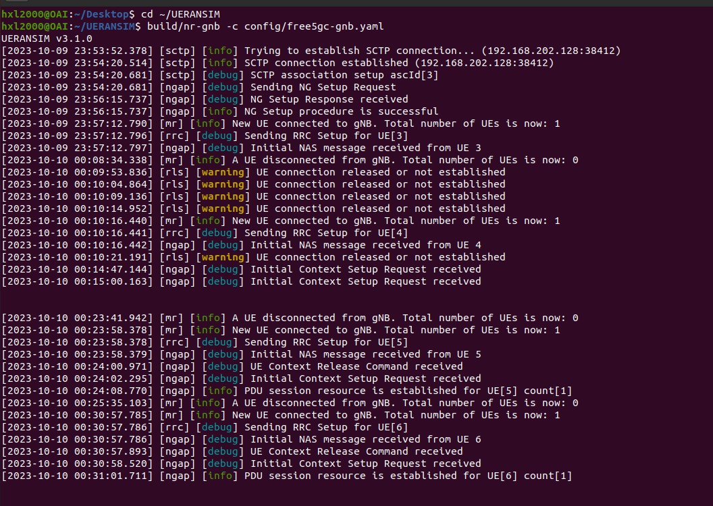
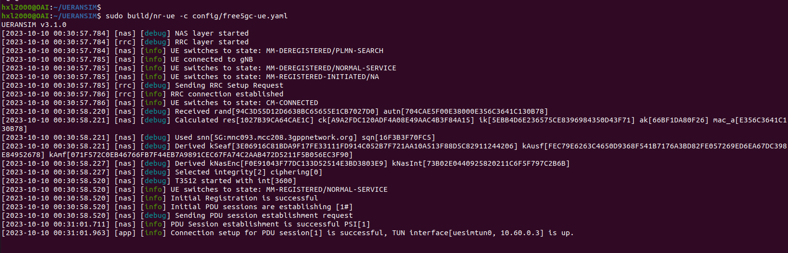
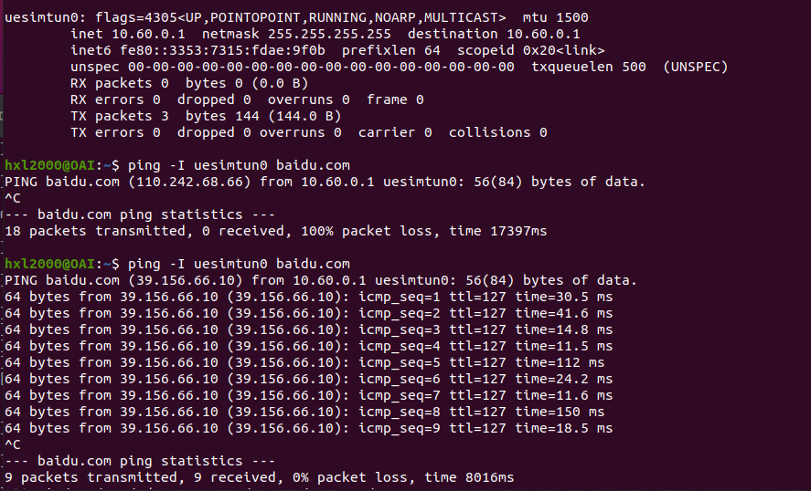
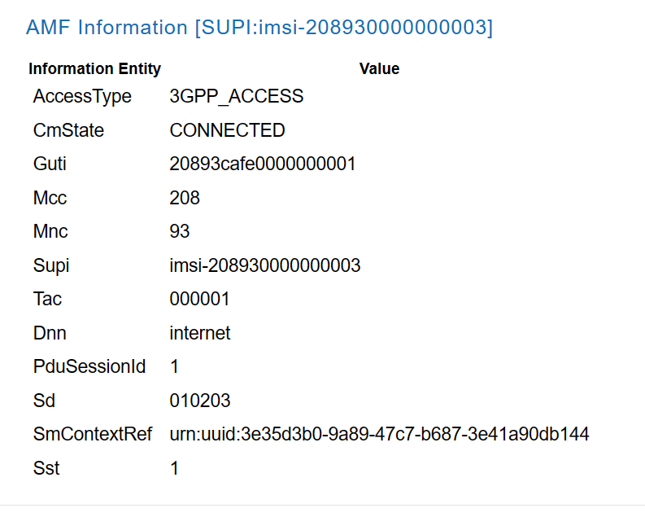

一台Ubuntu运行free5gc充当核心网，另一台Ubuntu主机运行UERANSIM gNB和模拟UE。

<!-- more -->


## 准备工作
### 虚拟机配置
- 确认安装的虚拟机内核版本
- 通过apt安装部分基础支持组件
```bash 
sudo apt install git-all
sudo apt-get install curl
sudo apt install net-tools
sudo apt install make
sudo apt -y install gcc
sudo apt -y install g++
sudo apt -y install autoconf
sudo apt -y install libtool
sudo apt -y install pkg-config
sudo apt -y install libmnl-dev
sudo apt -y install libyaml-dev
```
- **网卡设置** 
通过ifconfig命令查看linux系统上的网卡详情
  - 桥接模式
  - 桥接模式就是将主机网卡与虚拟机虚拟的网卡利用虚拟网桥进行通信。在桥接的作用下，类似于把物理主机虚拟为一个交换机，所有桥接设置的虚拟机连接到这个交换机的一个接口上，物理主机也同样插在这个交换机当中，所以所有桥接下的网卡与网卡都是交换模式的，相互可以访问而不干扰。在桥接模式下，虚拟机ip地址需要与主机在同一个网段，如果需要联网，则网关与DNS需要与主机网卡一致。
  - NAT模式（地址转化）
   NAT模式借助虚拟NAT设备和虚拟DHCP服务器，使得虚拟机可以联网。在NAT模式中，主机网卡直接与虚拟NAT设备相连，然后虚拟NAT设备与虚拟DHCP服务器一起连接在虚拟交换机VMnet8上， VMnet8虚拟网卡主要是为了实现主机与虚拟机之间的通信。
  - 仅主机模式
Host-Only模式其实就是NAT模式去除了虚拟NAT设备，然后使用VMware Network Adapter VMnet1虚拟网卡连接VMnet1虚拟交换机来与虚拟机通信的，Host-Only模式将虚拟机与外网隔开，使得虚拟机成为一个独立的系统，只与主机相互通讯。

**采用NAT与Host-Only两种网卡，通过ifconfig获取对应网卡的IP地址以及网卡名称，方便后续配置文件。**

本机网卡NAT模式：ens33 192.168.88.128
Host-Only模式：ens37 192.168.202.128

### git clone 代码时github拒绝访问
#### 解决办法
```bash
 #取消代理
 git config --global --unset http.proxy
 git config --global --unset https.proxy

#利用镜像网站访问，避免github不稳定
git config --global url."https://hub.njuu.cf".insteadOf https://github.com
```
**git clone 代码时注意要对应版本**

## Free5gc

### Free5gc安装

Free5gc的参考文档:[Home · free5gc/free5gc Wiki (github.com)](https://github.com/free5gc/free5gc/wiki)

#### 前置条件

##### Go 安装

Free5gc使用Go 1.17.8构建，因此需要先安装该版本的Golang：

```bash
#安装go语言环境
cd ~
wget https://dl.google.com/go/go1.17.8.linux-amd64.tar.gz
sudo tar -C /usr/local -zxvf go1.17.8.linux-amd64.tar.gz
mkdir -p ~/go/{bin,pkg,src}

#配置环境变量
echo 'export GOPATH=$HOME/go' >> ~/.bashrc
echo 'export GOROOT=/usr/local/go' >> ~/.bashrc
echo 'export PATH=$PATH:$GOPATH/bin:$GOROOT/bin' >> ~/.bashrc
echo 'export GO111MODULE=auto' >> ~/.bashrc
source ~/.bashrc

#查看go是否安装成功
go version
```

free5gc独立部署的日志模块，独立部署时必须安装
```bash
go get -u github.com/sirupsen/logrus  
```


在使用`go get -u github.com/sirupsen/logrus`时，可能会出现报错`package golang.org/x/sys/unix: unrecognized import path "golang.org/x/sys/unix" (https fetch: Get https://golang.org/x/sys/unix?go-get=1: dial tcp 216.239.37.1:443: i/o timeout)`

通过添加代理的方式解决
```bash
go env -w GO111MODULE=on
go env -w GOPROXY=https://goproxy.cn,direct  #编译不过去加代理
```


##### 用户面依赖

```bash
sudo apt -y update
sudo apt -y install mongodb wget git
sudo systemctl start mongodb
```

##### 控制面依赖

```bash
sudo apt -y update
sudo apt -y install git gcc g++ cmake autoconf libtool pkg-config libmnl-dev libyaml-dev
```

#### 源码下载与编译

##### 源码下载

```bash
cd ~
git clone --recursive -b v3.3.0 -j `nproc` https://github.com/free5gc/free5gc.git
cd ~/free5gc/NFs
ls *
```
若发现amf ausf n3iwf nrf nssf pcf smf udm udr文件为空，则手动git
```bash
# 删除空文件夹
rm -rf ~/free5gc/NFs/*
# 切换到NFs目录下
cd ~/free5gc/NFs
# 重新手动git（文件版本要与核心网版本对应）
git clone --recursive -b v1.2.0 -j `nproc` https://github.com/free5gc/amf.git/
git clone --recursive -b v1.2.0 -j `nproc` https://github.com/free5gc/ausf.git/
git clone --recursive -b v1.2.0 -j `nproc` https://github.com/free5gc/n3iwf.git/
git clone --recursive -b v1.2.0 -j `nproc` https://github.com/free5gc/nrf.git/
git clone --recursive -b v1.2.0 -j `nproc` https://github.com/free5gc/nssf.git/
git clone --recursive -b v1.2.0 -j `nproc` https://github.com/free5gc/pcf.git/
git clone --recursive -b v1.2.0 -j `nproc` https://github.com/free5gc/smf.git/
git clone --recursive -b v1.2.0 -j `nproc` https://github.com/free5gc/udm.git/
git clone --recursive -b v1.2.0 -j `nproc` https://github.com/free5gc/udr.git/
git clone --recursive -b v1.2.0 -j `nproc` https://github.com/free5gc/upf.git/

cd ~/free5gc
rm -rf ~/free5gc/NFs/webconsole  # webconsole 文件夹也为空，和处理一样，重新手动git webconsole文件
git clone --recursive -b v1.2.0 -j http://github.com/free5gc/webconsole.git
```

##### 编译源码

```bash
cd ~/free5gc
make
```

注意如果出现了编译失败，有可能是在上一步的源码下载部分出现问题。使用如下命令删除后重新下载：

```bash
cd ~
sudo rm -rf free5gc
```

#### UPF功能安装
注意构建GTP5G模块时，需要用普通用户构建，否则后续使用时会出错
```bash
cd ~
git clone  https://github.com/free5gc/gtp5g.git
cd gtp5g
make
sudo make install

#检查gtp5g是否安装
lsmod | grep gtp
```

#### WebConsole安装

Webconsole可用于观察UE注册信息。

##### 安装依赖

```bash
sudo apt install curl
sudo apt remove cmdtest
sudo apt remove yarn
curl -sS https://dl.yarnpkg.com/debian/pubkey.gpg | sudo apt-key add -
echo "deb https://dl.yarnpkg.com/debian/ stable main" | sudo tee /etc/apt/sources.list.d/yarn.list
curl -sL https://deb.nodesource.com/setup_12.x | sudo -E bash -
sudo apt-get update
sudo apt-get install -y nodejs yarn
```

##### 编译源码

```bash
cd ~/free5gc
make webconsole
```


### 运行WebConsle
```bash

cd ~/free5gc/webconsole
./bin/webconsole
```

终端机复印出使用网址:5000。然后再本机打开浏览器，输入网址http://192.168.202.128:5000

- 打开网页后，输入账号 admin，密码 free5gc
- 进入后拉宽浏览器，直到看到左侧Subscribers
- 选取 Subscribers 并新增一笔数据
- 注意除了 Operator Code Type 选择 OP 外，其它字段先保留预设数据，供后续模拟器使用
- 新增完成后，终端机按 Ctrl-C 就可停止 WebConsole

### 运行Free5gc核心网
free5gc提供了测试程序,若最终出现PASS字样即运行成功  

```bash
cd ~/free5gc
./test.sh TestRegistration
```
运行核心网
```bash
cd ~/free5gc
./run.sh
```
### 退出Free5gc核心网
如果在启动Free5gc核心网时遇到问题，在按下`ctrl+c`后还需关闭掉其他的一些已启动的进程：
```bash
cd ~/free5gc
./force_kill.sh
```

### Free5gc配置

配置`/config`下面的`amfcfg.yaml`,`smfcfg.yaml`以及`upfcfg.yaml`。

修改`ngapIpList`中的IP地址为运行核心网的主机上网用的IP地址。如：

#### amfcfg.yaml

```yaml
ngapIpList:  # the IP list of N2 interfaces on this AMF
    - 192.168.202.128
...
servedGuamiList: # Guami (Globally Unique AMF ID) list supported by this AMF
    # <GUAMI> = <MCC><MNC><AMF ID>
    - plmnId: # Public Land Mobile Network ID, <PLMN ID> = <MCC><MNC>
        mcc: 208 # Mobile Country Code (3 digits string, dihttp: 0~9)
        mnc: 93 # Mobile Network Code (2 or 3 digits string, dihttp: 0~9)
      amfId: cafe00 # AMF identifier (3 bytes hex string, range: 000000~FFFFFF)
  supportTaiList:  # the TAI (Tracking Area Identifier) list supported by this AMF
    - plmnId: # Public Land Mobile Network ID, <PLMN ID> = <MCC><MNC>
        mcc: 208 # Mobile Country Code (3 digits string, dihttp: 0~9)
        mnc: 93 # Mobile Network Code (2 or 3 digits string, dihttp: 0~9)
      tac: 1 # Tracking Area Code (uinteger, range: 0~16777215)
  plmnSupportList: # the PLMNs (Public land mobile network) list supported by this AMF
    - plmnId: # Public Land Mobile Network ID, <PLMN ID> = <MCC><MNC>
        mcc: 208 # Mobile Country Code (3 digits string, dihttp: 0~9)
        mnc: 93 # Mobile Network Code (2 or 3 digits string, dihttp: 0~9)
      snssaiList: # the S-NSSAI (Single Network Slice Selection Assistance Information) list supported by this AMF
        - sst: 1 # Slice/Service Type (uinteger, range: 0~255)
          sd: 010203 # Slice Differentiator (3 bytes hex string, range: 000000~FFFFFF)
        - sst: 1 # Slice/Service Type (uinteger, range: 0~255)
          sd: 112233 # Slice Differentiator (3 bytes hex string, range: 000000~FFFFFF)
```

#### smfcfg.yaml

修改N3接口的IP地址：

```yaml
interfaces: # Interface list for this UPF
          - interfaceType: N3 # the type of the interface (N3 or N9)
            endpoints: # the IP address of this N3/N9 interface on this UPF
              - 192.168.202.128
```

#### upfcfg.yaml

修改gtpude的N3接口的IP地址：

```yaml
gtpu:
  forwarder: gtp5g
  # The IP list of the N3/N9 interfaces on this UPF
  # If there are multiple connection, set addr to 0.0.0.0 or list all the addresses
  ifList:
    - addr: 192.168.202.128
      type: N3
      # name: upf.5gc.nctu.me
      # ifname: gtpif
```


## UERANSIM模拟5GRAN与UE
此时为另一台Ubuntu主机，参考第一台主机进行配置，或者直接克隆，Host—Only网卡：ens37 192.168.202.130

### 下载编译源码

```bash
cd ~
git clone https://github.com/aligungr/UERANSIM
cd UERANSIM
git checkout

#更新系统
sudo apt update
sudo apt upgrade

#安装工具
sudo apt install make
sudo apt install g++
sudo apt install libsctp-dev lksctp-tools
sudo apt install iproute2
sudo snap install cmake 

#编译
cd ~/UERANSIM
make
```

### 设置UERANSIM
在 ueransim，有两个配置文件跟free5GC有关：

- ~/UERANSIM/config/free5gc-gnb.yaml
- ~/UERANSIM/config/free5gc-ue.yaml
将`ngaplp`及`gtpip`的IP从127.0.0.1改成192.168.202.130，并将`amfConfigs`里的地址改成192.168.202.128
```yaml
...
  ngapIp: 192.168.202.130   # gNB's local IP address for N2 Interface (Usually same with local IP)
  gtpIp: 192.168.202.130    # gNB's local IP address for N3 Interface (Usually same with local IP)

  # List of AMF address information
  amfConfigs:
    - address: 192.168.202.128

```
接着可以检查~/UERANSIM/config/free5gc-ue.yaml，看设定资料是否和WebConsole里的资料一致(webconsole设置为OP，其他默认应该相同，仔细对比)

```yaml
# IMSI number of the UE. IMSI = [MCC|MNC|MSISDN] (In total 15 or 16 digits)
supi: 'imsi-208930000000003'
# Mobile Country Code value
mcc: '208'
# Mobile Network Code value (2 or 3 digits)
mnc: '93'

# Permanent subscription key
key: '8baf473f2f8fd09487cccbd7097c6862'
# Operator code (OP or OPC) of the UE
op: '8e27b6af0e692e750f32667a3b14605d'
# This value specifies the OP type and it can be either 'OP' or 'OPC'
opType: 'OP'

...

# Initial PDU sessions to be established
sessions:
  - type: 'IPv4'
    apn: 'internet'
    slice:
      sst: 0x01
      sd: 0x010203

# List of requested S-NSSAIs by this UE
slices:
  - sst: 0x01
    sd: 0x010203
...
```


### 测试free5gc+ueransim

登入`free5gc`主机，配置主机网络(防火墙设置)，每次重启都要重新配置
```bash
sudo sysctl -w net.ipv4.ip_forward=1
sudo iptables -t nat -A POSTROUTING -o {你上网的网卡名称} -j MASQUERADE
sudo systemctl stop ufw
sudo iptables -I FORWARD 1 -j ACCEPT
```
**注意需要修改`{你上网的网卡名称}`的内容（即NAT网卡）。使用`ifconfig`命令查看网络连接情况并找到自己上网的网卡。否则将会ping不通外网。**

配置完成后，启动核心网，可同时启动Web Console观察信息

```bash
cd ~/free5gc
./run.sh
```


登入`UERANSIM`主机，准备三个终端可视窗口执行UERANSIM模拟器

窗口一：确定模拟器已编译好，且配置文件也已经改好，执行nr-gnb

```bash
cd ~/UERANSIM
build/nr-gnb -c config/free5gc-gnb.yaml
```

窗口二：用管理员身份执行nr-ue

```bash
cd ~/UERANSIM
sudo build/nr-ue -c config/free5gc-ue.yaml
```

窗口三：用ping测试模拟器，free5GC核心网及互联网络是否联通。首先，用ifconfig检查是否有建立通道uesimtun0:

  

通过`PI -I uesimtun0 baidu.com`确认是否成功组网。



参考文档：
https://blog.csdn.net/weixin_42571882/article/details/121206781
https://www.freebuf.com/articles/wireless/268397.html